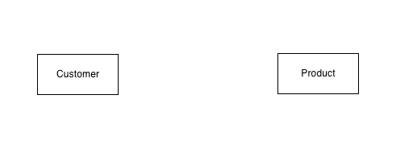
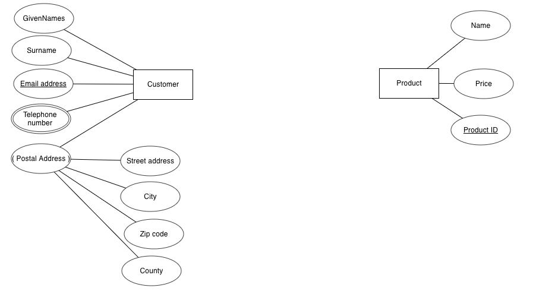
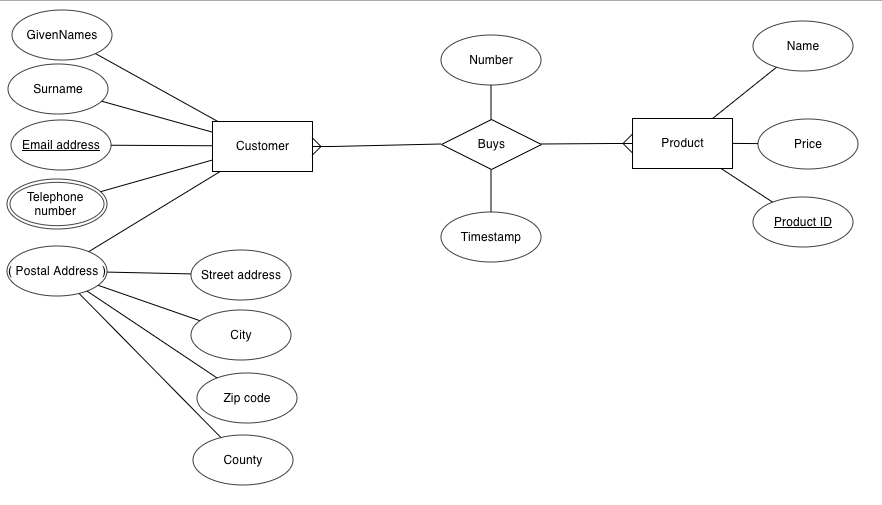
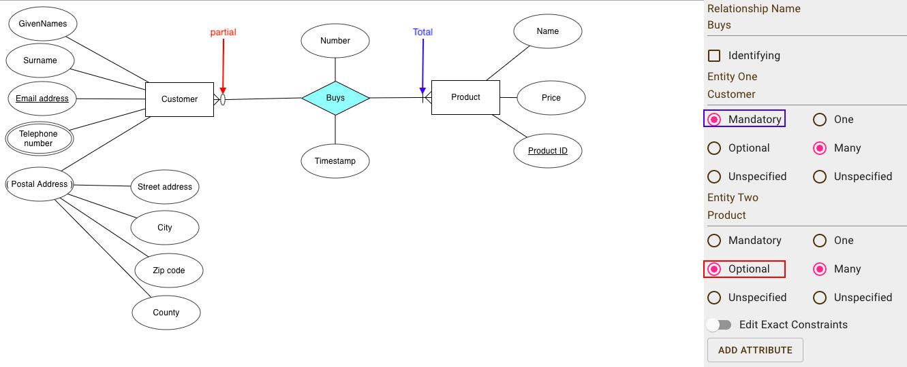
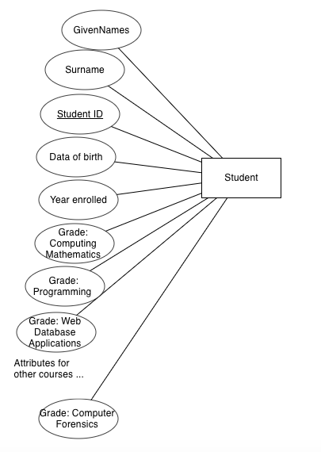
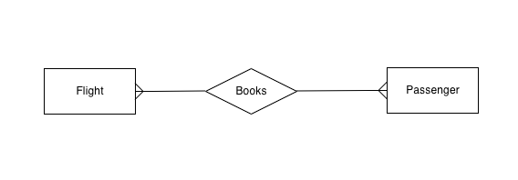
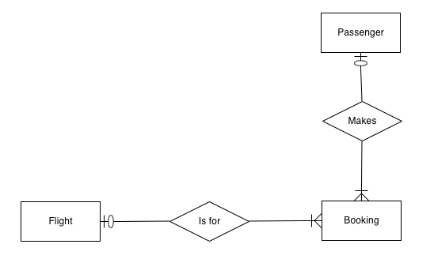
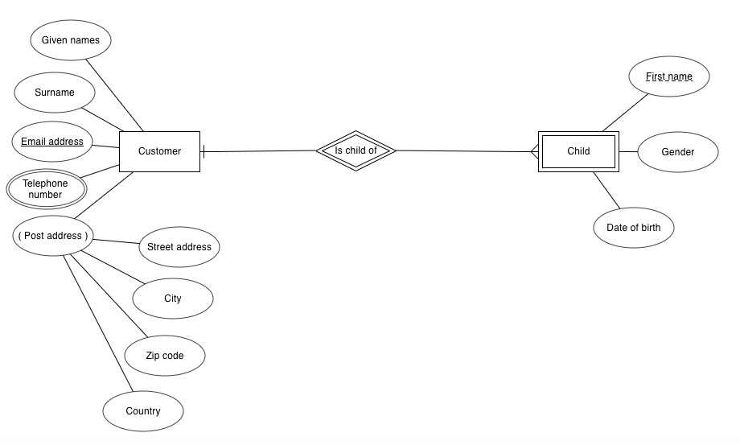

# CSCI 360 Spring 2021
# Chapter 4: Modeling and Designing Databases
# How NOT to develop a database
+ Q: quick design vs. good design
+ Example:
  - Version 1
    + Problem: students with the same name
    + Solution: unique ID
  
  |GivenNames|Surname|CourseName|Pctg|
  |---|---|---|---|
  |John Paul|Bloggs|Web Database Applications|72|
  |Sarah|Doe|Programming 1|87|
  |John Paul|Bloggs|Computing Mathematics|43|
  |John Paul|Bloggs|Computing Mathematics|65|
  |Sarah|Doe|Web Database Applications|65|
  |Susan|Smith|Computing Mathematics|75|
  |Susan|Smith|Programming 1|55|
  |Susan|Smith|Computing Mathematics|80|
  
    
  
  - Version 2
    + Problem: no order
    + Solution: more column(s)
  
  |StudentId|GivenNames|Surname|CourseName|Pctg|
  |---|---|---|---|---|
  |12345678|John Paul|Bloggs|Web Database Applications|72|
  |12345121|Sarah|Doe|Programming 1|87|
  |12345678|John Paul|Bloggs|Computing Mathematics|43|
  |12345678|John Paul|Bloggs|Computing Mathematics|65|
  |12345121|Sarah|Doe|Web Database Applications|65|
  |12345876|Susan|Smith|Computing Mathematics|75|
  |12345876|Susan|Smith|Programming 1|55|
  |12345303|Susan|Smith|Computing Mathematics|80|
  
    
    
  - Version 3
    + Problem: bloated
    + Solution: split up the information
  
  |StudentId|GivenNames|Surname|CourseName|Year|Sem|Pctg|
  |---|---|---|---|---|---|---|
  |12345678|John Paul|Bloggs|Web Database Applications|2004|2|72|
  |12345121|Sarah|Doe|Programming 1|2006|1|87|
  |12345678|John Paul|Bloggs|Computing Mathematics|2005|2|43|
  |12345678|John Paul|Bloggs|Computing Mathematics|2006|1|65|
  |12345121|Sarah|Doe|Web Database Applications|2006|1|65|
  |12345876|Susan|Smith|Computing Mathematics|2005|1|75|
  |12345876|Susan|Smith|Programming 1|2005|2|55|
  |12345303|Susan|Smith|Computing Mathematics|2006|1|80|
  
    
  - Version 4
    + Problem: other information?
    + Solution: keep adding more columns or tables
  
  |StudentId|GivenNames|Surname|
  |---|---|---|
  |12345678|John Paul|Bloggs|
  |12345121|Sarah|Doe|
  |12345876|Susan|Smith|
  |12345303|Susan|Smith|
  
  |StudentId|CourseName|Year|Sem|Pctg|
  |---|---|---|---|---|
  |12345678|Web Database Applications|2004|2|72|
  |12345121|Programming 1|2006|1|87|
  |12345678|Computing Mathematics|2005|2|43|
  |12345678|Computing Mathematics|2006|1|65|
  |12345121|Web Database Applications|2006|1|65|
  |12345876|Computing Mathematics|2005|1|75|
  |12345876|Programming 1|2005|2|55|
  |12345303|Computing Mathematics|2006|1|80|
  
    
  
# The Database Design Process
+ three major stages in database design
  - Requirements analysis
    + what exactly the database is needed for
    + what data will be stored
    + how the data items relate to each other
  - Conceptual design
    + distill requirements into a formal description of the database design
  - Logical design
    + map the database design onto an actual database management system and database tables
# The Entity Relationship Model
+ A model which can help transform the requirements into a formal description of the entities and relationships(conceptual design) that appear in the database.
+ Entities
  - distinct objects
+ Relationships
  - associations between these entities
+ Example:
  - Database: University
  - Entities: Student and Course
  - Relationship: Enrollment
## Representing Entities
Note: the tool I use here is an online tool called [erdplus](https://erdplus.com/). You can use other tools to create ER models.
+ entity set 
  - a rectangle containing the entity name
  
  
  
+ attributes
  - Attributes describe the entity
  - you need to understand different types of attributes
    + simple attributes: an simple oval
    + composed attributes: an oval(sometimes the attribute name is surrounded by a pair of ()) connected by other ovals(these are simple attributes)
    + multivalued attribute: two ovals
    + key: 
      - candidate keys
      - primary key: an oval with underlined name
  - attribute characteristics
    + Attribute values are chosen from a **domain** of legal values
    + Attributes can be empty(NULL value), but primary key must be **NOT NULL**.
    + You should think carefully when classifying an attribute as multivalued
    + For some applications, no combination of attributes can uniquely identify an entity (or it would be too unwieldy to use a large composite key), so we create an artificial attribute.
  
## Representing Relationships
+ Types of relationships
  - one-to-one(1:1)
  - one-to-many(1:N)
  - many-to-many(M:N)
+ In an ER diagram, we represent a relationship set with a named diamond。
+ The number of entities on either side of a relationship (the cardinality of the relation- ship) define the key constraints of the relationship.
  

  
## Partial and Total Participation(Mandatory and optional relationships)
+ Relationships between entities can be optional or compulsory.
+ Example:
  - We could decide that a person is considered to be a customer only if they have bought a product(Total Participation).
  - We can have people listed as customers in our database who never buy a product(Partial Participation). 
  
  
  
## Entity or Attribute?
+ Is the item of direct interest to the database?
  - Objects of direct interest should be entities
  - Information that describes them should be stored in attributes.
+ Does the item have components of its own?
  - If so, a separate entity might be the best solution.
+ Can the object have multiple instances?
  - If so, the cleanest way to do this is to represent the object as a separate entity.
+ Is the object often nonexistent or unknown?
  - If so, it is effectively an attribute of only some of the entities, and it would be better to model it as a separate entity rather than as an attribute that is often empty.
  
  
  
  
  
  
## Entity or Relationship?
+ An easy way to decide whether an object should be an entity or a relationship is to map nouns in the requirements to entities, and to map the verbs to relations.
+ Example: “A degree program is made up of one or more courses,” 
  - entities: degree and course
  - relationship: is made up of
## Intermediate Entities
+ It is often possible to conceptually simplify many-to-many relationships by replacing the many-to-many relationship with a new intermediate entity (sometimes called an associate entity) and connecting the original entities through a many-to-one and a one-to-many relationship.
+ Example: A passenger can book a seat on a flight(many-to-many).
  - Any given flight can have many passengers with a booking.
  - Any given passenger can have bookings on many flights.
  
  
  
  - intermediate entity: the booking
    + Each passenger can be involved in multiple bookings, but each booking belongs to a single passenger(one-to-many).
    + there can be many bookings for a given flight, but each booking is for a single flight(one-to-many).
    + Since each booking must be associated with a par- ticular passenger and flight, the booking entity participates totally in the relationships with these entities. This total participation could not be captured effectively in the representation in figure above.
    
    
  
## Weak and Strong Entities
+ In database design, we can omit some key information for (week) entities that are dependent on other (strong) entities.
+ The relationship between a week entity and a strong entity is called an **identifying relationship**.
+ In the ER diagram, we show weak entities and identifying relationships with double lines, and the partial key of a weak entity with a dashed underline.

## Summary of ER Diagram Symbols
+ EDRPlus

+ Textbook

# Entity Relationship Modeling Examples
# Using the Entity Relationship Model
## Using Tools for Database Design
+ MySQL Workbench
  - [Download MySQL Workbench](https://dev.mysql.com/downloads/workbench/)
    + If you need to use an older version, click on the **Archive** tab.
  - [How To Connect To MySQL Server After Install XAMPP On Mac OS](https://www.dev2qa.com/how-to-connect-to-mysql-server-after-install-xampp-on-mac-os/#:~:text=After%20download%20XAMPP%20mac%20os,and%20ftp%20server%20as%20service.)
  -[create a new user](https://stackoverflow.com/questions/1559955/host-xxx-xx-xxx-xxx-is-not-allowed-to-connect-to-this-mysql-server)

