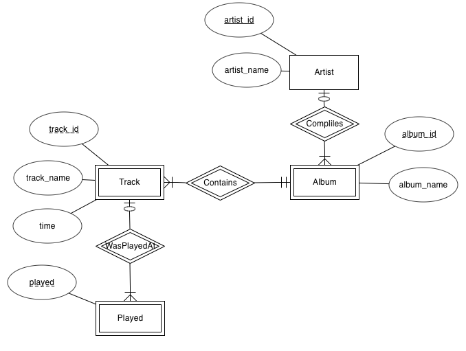

# CSCI 360 Spring 2021
# Chapter 5: Basic SQL
+ SQL is the only database language in widespread use.
  - It was first proposed in the early 1970s.
  - The latest standard is SQL-2003.
  - MySQL supports most of the features of SQL-1992 and many from the newer SQL standards, but it also includes many non- standard features that give more control over the database server and how it evaluates queries and returns results.
+ Objectives
  - **SELECT** to read
  - **INSERT** to add
  - **UPDATE** to change
  - **DELETE** to remove
## Use the **music** database
+ You need to understand the batch mode example we leart in [Chapters 1, 2, and 3](../Slides/Chapter010203.md) to create the **music** database
+ It is also very important to understand the ER model of the **music** database in [Chapter 4](../Slides/Chapter04.md)
+ It is also very important to understand the ER model of the **music** database in [Chapter 4](../Slides/Chapter04.md)

    

    
+ Start the MySQL Monitor and choose the **music** database, and you can check that this is the active database by typing in the SELECT DATABASE( );
  

+ explore what tables make up the music database

+ explore the columns in a table

  - You can try to show the columns of the other tables.
  - To have a better understanding of the results, you can compare the results of the **SHOW COLUMNS FROM** with the ER model and the code.
  
    
# The SELECT Statement and Basic Querying Techniques
## Single Table SELECTs

+ A simple SELECT statement has four components:
  - The keyword SELECT.
  - The columns to be displayed. In our first example, we asked for all columns by using the asterisk (*) symbol as a wildcard character.
  - The keyword FROM.
  - The table name; in this example, the table name is artist.
## Choosing Columns
+ Choose one column

+ Choose more than one columns and display in order

+ You can even list columns more than once, this is useful when combined with aliases in more advanced queries in [Chapter 7](../Slides/Chapter07.md)

+ Specify databases, tables, and column names in a SELECT statement
  - to avoid the USE command
  - to helps resolve ambiguities, as we show later in “Joining Two Tables”

## Choosing Rows with the WHERE Clause
### WHERE basics
+ Used to return rows that match a condition
+ Example
  - find out the details of the artist with the name “New Order.”

  
  
  - find out the name of the artist with an artist_id value of 4.
  
  
  
  - more where conditions
  
  ~~~~
  SELECT track_name FROM track WHERE track_id = 13;
  SELECT artist_name FROM artist WHERE artist_id < 5;
  SELECT album_name FROM album WHERE album_id <> 2;
  ~~~~

+ Operators
  - equals (=)
  - greater than (>)
  - less than (<)
  - less than or equal (<=)
  - greater than or equal (>=)
  - not equal (<> or !=)
+ Note: you can us the operators both for numbers and strings.

~~~~
SELECT artist_name FROM artist WHERE artist_name < 'M';
~~~~

+ String match/wild cards
  - percentage character (%): zero or more characters
  
  
  
  - underscore character (\_): exactly one character
    + Note that there are two underscores and one spacebar in the following example.

  

### Combining conditions with AND, OR, NOT, and XOR

~~~~
SELECT album_name FROM album WHERE album_name > "C" AND album_name < "M";

SELECT album_name FROM album WHERE album_name LIKE "L%" OR album_name LIKE "S%" OR album_name LIKE "P%";
~~~~
~~~~
SELECT album_name FROM album WHERE album_name LIKE "L%" OR album_name LIKE "S%" AND album_name LIKE "%g";

SELECT album_name FROM album WHERE album_name LIKE "L%" OR (album_name LIKE "S%" AND album_name LIKE "%g");

SELECT album_name FROM album WHERE (album_name LIKE "L%" OR album_name LIKE "S%") AND album_name LIKE "%g";
~~~~
~~~~
SELECT * FROM album WHERE NOT (album_id = 1 OR album_id = 3);

SELECT * FROM album WHERE NOT (album_id = 1) AND NOT (album_id = 3);

SELECT * FROM album WHERE album_id != 1 AND album_id != 3;

SELECT * FROM album WHERE album_id != 1 AND NOT (album_id = 3);
~~~~
## ORDER BY Clauses
+ sort the results if we want them in a particular order.
+ Sorting has no effect on what is returned, and only affects what order the results are returned.
+ The ORDER BY clause indicates that sorting is required, followed by the column that should be used as the sort key.
+ The default sort is case-insensitive and in ascending order.

+ Multiple sort keys.
  - If the values of the first key are the same, the order will be determined by the second key.
  

+ sort in descending order

+ a mixture of ascending and descending orders
  - Note: WHERE always appears before ORDER BY in the SELECT statement.

+ If you do want sorting to behave like ASCII does, you can add a BINARY keyword.
  - Example 1:
  ~~~~
  SELECT * FROM artist ORDER BY BINARY artist_name;
  ~~~~
  - Example 2: searching for tracks with names alphabetically earlier than the letter b(Compare the following two queries)
  
  ~~~~
  SELECT track_name FROM track WHERE track_name < 'b';
  SELECT track_name FROM track WHERE track_name < BINARY 'b';
  ~~~~

+ Treat a column as a different data type
  - Example: you want to sort the track table by ascending time, but you want the times to be treated as strings. 
  
  
  
  - data types
  
  ~~~~
  • AS BINARY, to sort as binary, which has the same effect as ORDER BY BINARY • AS SIGNED, to sort as a signed integer
  • AS UNSIGNED, to sort as an unsigned integer
  • AS CHAR, to sort as a character string
  • AS DATE, to sort as a date
  • AS DATETIME, to sort as a date and time • AS TIME, to sort as a time
  ~~~~
  

## The LIMIT Clause
+ The LIMIT clause is a useful, nonstandard SQL tool that allows you to control which rows are output.
+ Example 1: only display the first 10 rows

+ Example 2: display 10 rows, starting from the 6th row(note the index starts from 0)

+ Example 3: choose a start point, the display to the end of the table(you do not know how many rows, you can choose a relatively large number. Technically, the largest number you can use is 18446744073709551615).

## Joining Two Tables
# The INSERT Statement

# The DELETE Statement

# The UPDATE Statement
