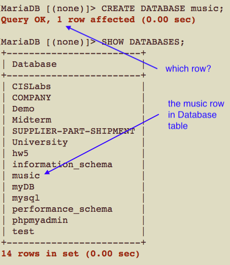
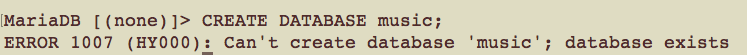
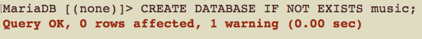
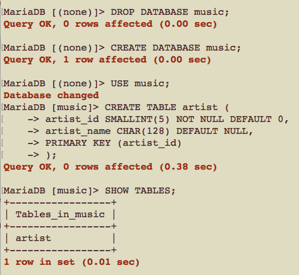
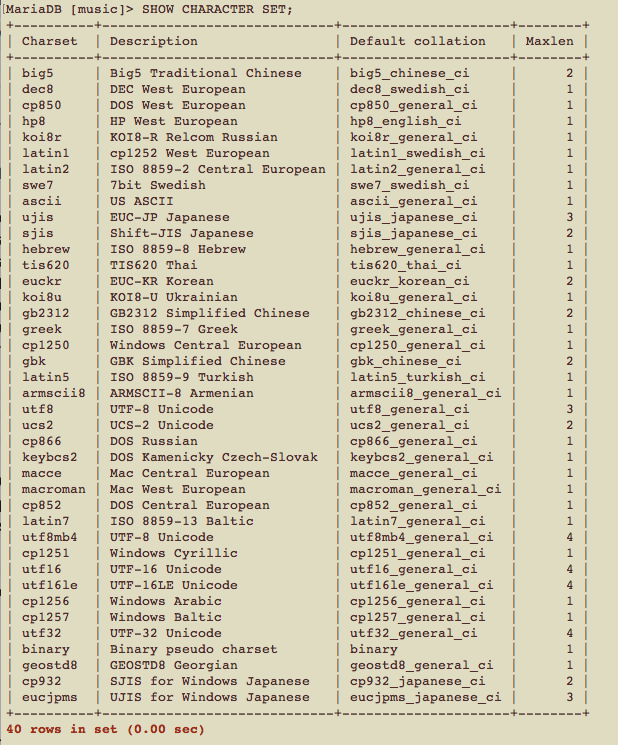
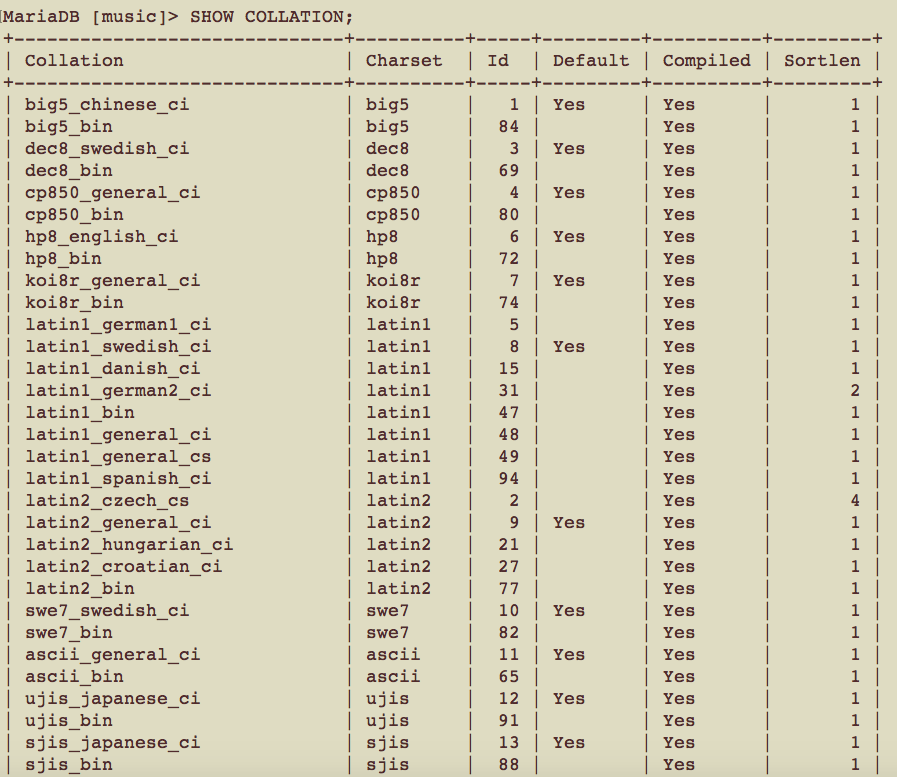
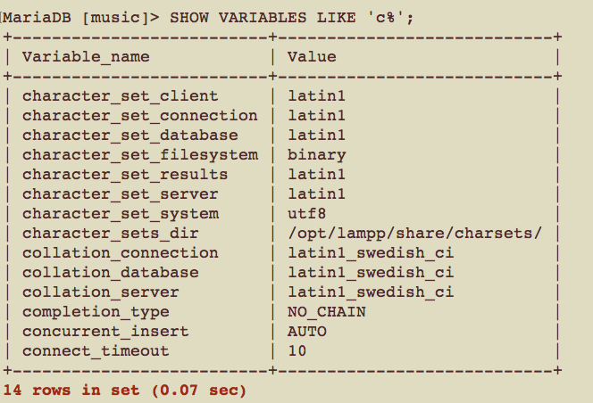
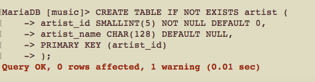

# CSCI360 Spring 2021
# Chapter 6 Working with Database Structures
+ Objectives: dealing with **METADATA**
  - create database
  - create tables, including columns
  - alter structures
  - delete structures
# Creating and Using Databases
+ Syntax
~~~~
CREATE DATABASE database_name;
~~~~

+ Example(Assume the music database has not been created)

+ If the dabases has already existed, the statement above yields an error.

+ So we revise the syntax to avoid such error.

~~~~
CREATE DATABASE IF NOT EXISTS database_name;
~~~~

+ Conventions and Restrictions
  - use lowercase names for databases to make your SQL machine-independent
    + case-sensitive in Mac OS and Linux
    + case-insensitive in Windows
  - max lenght: 64 characters
  - don't use reserved words (SELECT, FROM, USE...)
  - don't use special characters(slash, back slash, semicolon, period)
  - don't use whitespace as the last character for a database name
  
  ~~~~
  CREATE DATABASE IF NOT EXISTS mus;ic
  -- CREATE DATABASE IF NOT EXISTS mus; is a vailid statement, database mus will be created
  -- ic is not a valid statement, it yields one error.
  ~~~~
# Creating Tables

## Basics
+ Make sure the **music** database is "empty"(no tables have been created). If the dabased with tables has been loaded, run the following statements to drop the database and create it again, then you can create tables.

+ Syntax for a table
~~~~
CREATE TABLE table_name(
column_1_defination,
column_2_defination,
...
column_m_defination,
optinal_key_definition
);
~~~~

+ Syntax for a column
~~~~
name type [NOT NULL | NULL] [DEFAULT value]
~~~~
  - **name**: fewer limitations, but better to consistently choose lowercase names for developer-driven choices (such as database, alias, and table names) and avoid characters that require you to remember to use backticks.
  - **type**: data type(how the data is stored? e.g. CHAR for strings, SMALLINT for numbers, or TIMESTAMP for a date and time...)
  - **NOT NULL | NULL**: valid **with | without** a value
  - **DEFAULT value**: If you specify a value with the DEFAULT clause, it’ll be used to populate the column when you don’t otherwise provide data.
    + The value must be a constant (such as 0, "cat", or 20060812045623), except if the column is of the type TIMESTAMP.
    + Sometimes, the DEFAULT value workks. Sometimes, it doesn't.
    ~~~~
    -- assume no rows in table artist
    INSERT INTO artist SET artist_name = "Duran Duran";
    INSERT INTO artist SET artist_name = "Bob The Builder";
    ~~~~
## Collation and Character Sets
+ When you’re comparing or sorting strings, how MySQL evaluates the result depends on the character set and collation used.
+ **Character sets** define what characters can be stored.
+ A **collation** defines how strings are ordered.
+ The default character set is latin1, and the default collation is latin1\_swedish\_ci.
+ You can list the character sets available on your server with the SHOW CHARACTER SET command.

+ You can list the collation orders and the character sets they apply to.

+ You can see the current defaults on your server as follows:

+ When you’re creating a database, you can set the default character set and sort order for the database and its tables.

~~~~
CREATE DATABASE music DEFAULT CHARACTER SET latin1 COLLATE latin1_swedish_cs;
~~~~

## Other Features
+ **IF NOT EXISTS**

+ **AUTO_INCREMENT**
+ **Column comments**
  - add a comment to a column; displayed when you use the SHOW CREATE TABLE command
+ **Foreign key constraints**
  - We don’t recommend using foreign key constraints for most applications.
  - This feature is currently supported for only the InnoDB table type.
+ **Creating temporary tables**
  - The table will be removed (dropped) when the monitor connection is closed.

+ **Advanced table options**
  - the starting value of AUTO_INCREMENT
  - the way indexes and rows are stored
  - options to override the information that the MySQL query optimizer gathers from the table
+ **Control over index structures**
  - For some table types, you’ve been able to control what type of internal structure—such as a B-tree or hash table—MySQL uses for its indexes. You can also tell MySQL that you want a full text or spatial data index on a column, allowing special types of search.
###  SHOW CREATE TABLE
+ display some advanced options
  - The names of the table and columns are enclosed in backticks. This isn’t necessary, but it does avoid any parsing problems that can occur through using reserved words and special characters.
  - An additional default ENGINE clause is included, which explicitly states the table type that should be used. The setting in a default installation of MariaDB(XAMPP platform) is InnoDB, while MyISAM for MySQL.
  - AnadditionalDEFAULT CHARSET=latin1 clause is included.

## Column Types
### Common column types
+ Six common types.
#### INT[(width)] [UNSIGNED] [ZEROFILL]
### Other integer types
### Other rational number types
### Other date and time types
### Other string types

## Keys and Indexes
## The AUTO_INCREMENT Feature
## The Sample Music Database

# Altering Structures
## Adding, Removing, and Changing Columns
## Adding, Removing, and Changing Indexes
## Renaming Tables and Altering Other Structures

# Deleting Structures
## Dropping Databases
## Removing Tables
