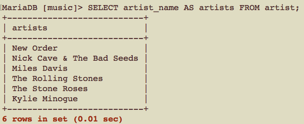
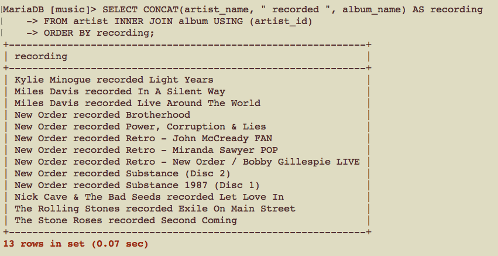
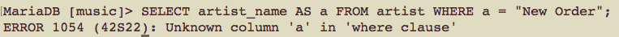

# CSCI360 Spring 2021
# Chapter 7: Advanced Querying
+ Complete SELECT Query
~~~~
SELECT DISTINCT column, AGG_FUNC(column_or_expression), …
FROM mytable
    JOIN another_table
      ON mytable.column = another_table.column
    WHERE constraint_expression
    GROUP BY column
    HAVING constraint_expression
    ORDER BY column ASC/DESC
    LIMIT count OFFSET COUNT;
~~~~
+ Query order of execution

|Order|Clause|
|---|---|
|1|FROM and JOIN|
|2|WHERE|
|3|ORDER BY|
|4|GROUP BY|
|5|HAVING|
|6|SELECT|
|7|DISTINCT|
|8|LIMIT|

# Aliases
+ Aliases are nicknames for columns, tables, or function name, allowing you to:
  -  Write shorter queries
  -  Express your queries more clearly
  -  Use one table in two or more ways in a single query
  -  Access data more easily from programs (for example, from PHP scripts, as dis- cussed in [Chapter 14](../Slides/Chapter14.md))
  -  Use special types of nested queries; these are the subject of “Nested Queries,” discussed later in this chapter
## Column Aliases
+ individual column(s)
~~~~
SELECT column_name1 AS alias_name1, column_name2 AS alias_name2, ... 
FROM table_name
...;
~~~~

+ concatenated columns (with strings)
  - The MySQL function CONCAT( ) concatenates together the strings
  - Column names and strings can be in any order.
  - After we create an alias, we can use it throughout the query. 
    + For example, if we do not use an alias in the following query, you need to write the `ORDER BY` clause as `ORDER BY CONCAT(artist_name, " recorded ", album_name)`.
~~~
SELECT CONCAT(column_name1, string1, column_name2, string2 ...) AS alias_name
FROM table_name
...;
~~~

+ **Column aliases can NOT be use in WHERE clause, or in the USING and ON clauses**

+ **Column aliases can be use in ORDER BY, GROUP BY, and HAVING clauses**
+ The AS keyword is optional (using the AS keyword is recommended).

~~~~
SELECT artist_id AS id FROM artist WHERE artist_name = "New Order";
SELECT artist_id id FROM artist WHERE artist_name = "New Order";
~~~~

+ They can be at most 255 characters in length and can contain any character. 
+ If you plan to use characters that might confuse the MySQL parser—such as periods, commas, or semicolons—make sure you enclose the alias name in backticks. 
+ We recommend using lowercase alphanumeric strings for alias names and using a consistent character choice—such as an underscore—to separate words. 
+ Aliases are case-insensitive on all platforms.

## Table Aliases
+ Syntax: after defining the alias, you can use `alias_name` in other clauses.
~~~~
table_name AS alias_name
~~~~
+ Example
~~~~
SELECT ar.artist_id, al.album_name, ar.artist_name 
FROM album AS al INNER JOIN artist AS ar
USING (artist_id) WHERE al.album_name = "Brotherhood";
~~~~
+ there are no restrictions on where table aliases can be used in queries.
+ the AS keyword is optional.
+ table aliases allow you to write queries that you can’t otherwise easily express.
  - Example: Find out if two or more artists have released an album of the same name and, if so, what the identifiers for those artists are.
  ~~~
  SELECT a1.artist_id, a2.album_id
  FROM album AS a1, album AS a2 
  WHERE a1.album_name = a2.album_name AND a1.artist_id != a2.artist_id;
  ~~~
  

# Aggregating Data
+ Aggregate functions allow you to discover the properties of a group of rows.
## The DISTINCT Clause
+ more of a post-processing filter that allows you to remove duplicates.
~~~
SELECT DISTINCT clumn_name1, column_name2, ... FROM 
...;
~~~
+ Compare the following three queries.
~~~
SELECT artist_name FROM
artist INNER JOIN album USING (artist_id);

SELECT DISTINCT artist_name FROM
artist INNER JOIN album USING (artist_id);

SELECT DISTINCT artist_name, album_name FROM 
artist INNER JOIN album USING (artist_id);
~~~

+ To remove duplicates, MySQL needs to sort the output. You should use DISTINCT (and other aggregate functions) with caution on large data sets.
## The GROUP BY Clause
+ The GROUP BY clause sorts data into groups for the purpose of aggregation. 
+ GROUP BY is used to organize the data before other clauses — such as WHERE, ORDER BY, and functions — areapplied.
+ ORDER BY is applied last — after the query has been resolved — to reorganize the query output for display.
+ COUNT( ) function can count off the number of instances/rows in each group.
  - Note: `COUNT(artist_name)` is the same as `COUNT(*)` or `COUNT(artist_id)` in the following query.
~~~~
SELECT artist_name, COUNT(artist_name) FROM
artist INNER JOIN album USING (artist_id)
GROUP BY artist_name;
~~~~
+ Muti-way INNER JOIN in one query: find out how many tracks are on each album, along with the artist and album name.

~~~~
SELECT artist_name, album_name, COUNT(*) FROM
artist INNER JOIN album USING (artist_id)
INNER JOIN track USING (artist_id, album_id)
GROUP BY artist.artist_id, album.album_id;
~~~~

+ More example: find out how many times we’ve listened to tracks on each album with the artist and album names.
~~~~
SELECT artist_name, album_name, COUNT(*) FROM
artist INNER JOIN album USING (artist_id)
INNER JOIN track USING (artist_id, album_id)
INNER JOIN played USING (artist_id, album_id, track_id)
GROUP BY album.artist_id, album.album_id;
~~~~

+ Use GROUP BY clause without an aggregate function is meaningless
~~~~
SELECT * FROM track GROUP BY artist_id;
~~~~

### Other aggregate functions
+ AVG( ): Returns the average (mean) of the values in the specified column for all rows in a group.

+ MAX( ): Returns the maximum value from rows in a group.
+ MIN( ): Returns the minimum value from rows in a group.
+ STD( ) or STDDEV( ): Returns the standard deviation of values from rows in a group.
+ SUM( ): Returns the sum of values from rows in a group
+ other functions: see [MySQL manual under the heading “GROUP BY (Aggregate) Functions.”](http://download.nust.na/pub6/mysql/doc/refman/5.1/en/group-by-functions.html)
## The HAVING Clause

# Advanced Joins
## The Inner Join
## The Union
## The Left and Right Joins
## The Natural Join

# Nested Queries
## User Variables
## Transactions and Locking

# Table Types
## MyISAM
## Memory or Heap
## InnoDB
### Transaction examples
## BDB
