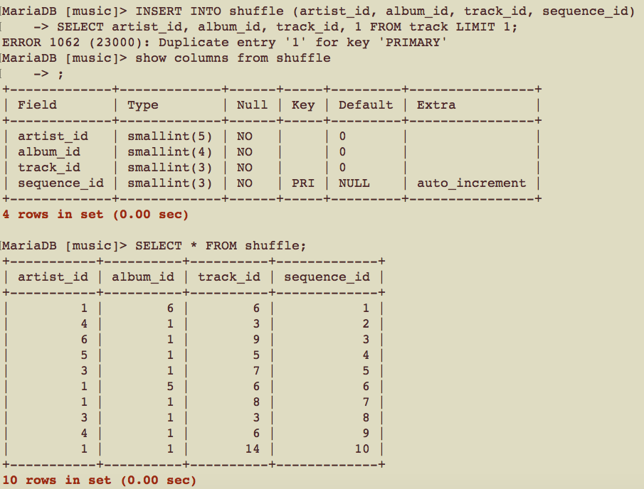
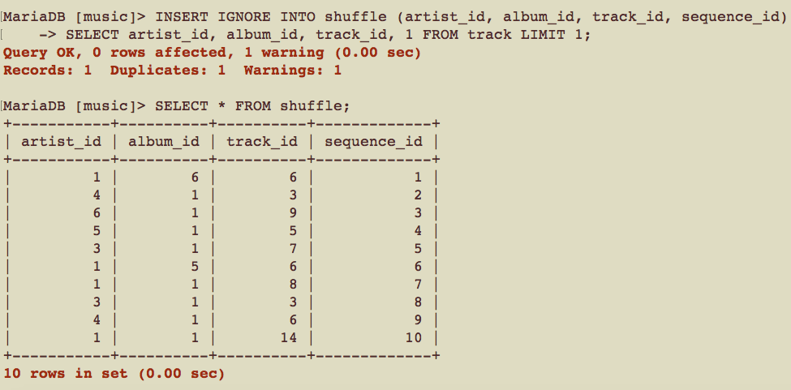
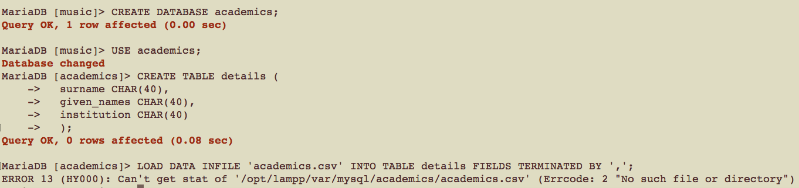
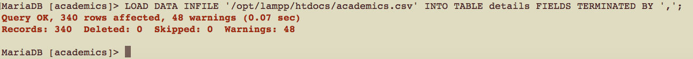
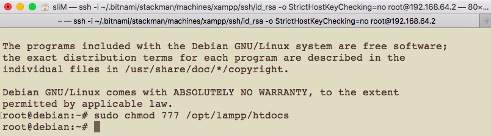

# CSCI360 Spring 2021
# Chapter 8: Doing More with MySQL
+ In this chapter, you’ll learn how to:
  - Insert data into a database from other sources, including with queries and from text files
  - Perform updates and deletes using multiple tables in a single statement
  - Replace data
  - Use MySQL functions in queries to meet more complex information needs
  - Analyze queries using the `EXPLAIN` statement and then improve their performance with simple optimization techniques
+ Note: we are still using the music database in this chapter.
# 1.Inserting Data Using Queries
+ Let's create a new table `shuffle`
~~~~
CREATE TABLE shuffle (
  artist_id SMALLINT(5) NOT NULL DEFAULT 0,
  album_id SMALLINT(4) NOT NULL DEFAULT 0,
  track_id SMALLINT(3) NOT NULL DEFAULT 0,
  sequence_id SMALLINT(3) AUTO_INCREMENT NOT NULL,
  PRIMARY KEY (sequence_id)
  );
~~~~
+ To insert data into this table, we can use the results of a SELECT statement.
  - The SELECT statement outputs a list of columns that must match the type and order of the list provided for the INSERT INTO statement (or the implicit, complete list if one isn’t provided)
  - the sequence_id is auto- matically created using MySQL’s AUTO_INCREMENT feature, and so isn’t specified in the statements.
  - ORDER BY RAND( ): this orders the results according to the MySQL function RAND( ). The RAND( ) function returns a pseudorandom number in the range 0 to 1.
  - The SELECT statement in an INSERT INTO statement can use all of the features of SELECT statements. You can use joins, aggregation, functions, and any other features you choose. 
~~~~
INSERT INTO shuffle (artist_id, album_id, track_id)
SELECT artist_id, album_id, track_id FROM
track ORDER BY RAND() LIMIT 10;
~~~~
+ You can also query data from one database into another, by prefacing the table names with the database name followed by a period (.) character.
~~~~
CREATE DATABASE art;
USE art;
CREATE TABLE people (
  people_id SMALLINT(4) NOT NULL,
  name CHAR(128) NOT NULL,
  PRIMARY KEY (people_id));

INSERT INTO art.people (people_id, name)
SELECT artist_id, artist_name FROM music.artist;
~~~~
+ When you try to insert duplicate key values, MySQL will abort.

+ If you want MySQL to ignore this and keep going, add an IGNORE keyword after the INSERT.
  - MySQL doesn’t complain, but it does report that it encountered a duplicate. 

# 2.Loading Data from Comma-Delimited Files
+ A staggeringly large amount of time spent by IT professionals is devoted to reformatting data from one application to suit another.
+ It is common that having data in comma-separated values (CSV) files, then the design of a database.
+ We only focus on importing csv data in this section, if you need to convert other files to csv files, you can use:
  - the [xls2csv script](http://search.cpan.org/~ken/xls2csv) to automate the conversion from the Excel spread- sheet files to text files of comma-separated values.
  - tools such as sed and awk to convert text data into a CSV format suitable for import by MySQL. 
+ Download academics.csv from [link 1](http://tahaghoghi.com/LearningMySQL/downloads.php) or [link 2](https://github.com/ZhangNingSAU/Spring-2021-CSCI-360-Database-Mgmt-Systems/blob/main/Resources/academics.csv)
+ Import the data from the csv file
~~~~
CREATE DATABASE academics;
USE academics;
CREATE TABLE details (
  surname CHAR(40), 
  given_names CHAR(40),
  institution CHAR(40)
  );

LOAD DATA INFILE 'academics.csv' INTO TABLE details FIELDS TERMINATED BY ',';
~~~~

+ If the academics.csv file isn’t in the current directory, you’ll need to specify the full path.

# 3.Writing Data into Comma-Delimited Files
~~~
USE music;

SELECT artist_name, album_name FROM artist, album 
WHERE artist.artist_id=album.artist_id;
~~~
+ We can change this SELECT query slightly to write this data into an output file as comma-separated values:
  - By default, the permission of the htdocs directory does NOT include writability. 
    + If you are using MacOS, You need to change the permission(You may need to enter your password).
  
    
    
    + If you are using Windows, run XAMPP as administrator.
    
    
    
    
  - If you are using Windows OS, replace `/opt/lampp/htdocs/` with `C:\xampp\htdocs\`
  - If the file has exsited, there will be an error(You need to delete that file first).
~~~~
SELECT artist_name, album_name FROM artist, album 
WHERE artist.artist_id=album.artist_id
INTO OUTFILE '/opt/lampp/htdocs/artists_and_albums.csv' FIELDS TERMINATED BY ',';
~~~~
# 4.Creating Tables with Queries
# 5.Updates and Deletes with Multiple Tables
## 5.1 Deletion
## 5.2 Updates
# Replacing Data
# The EXPLAIN Statement
