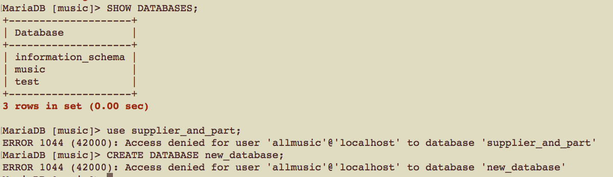
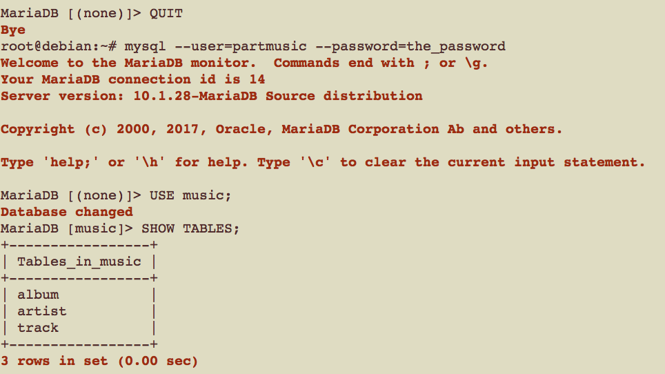
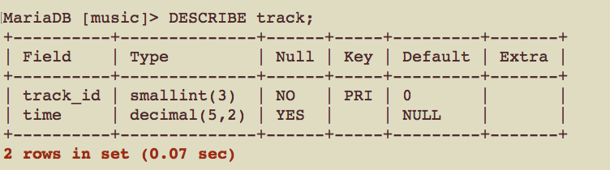
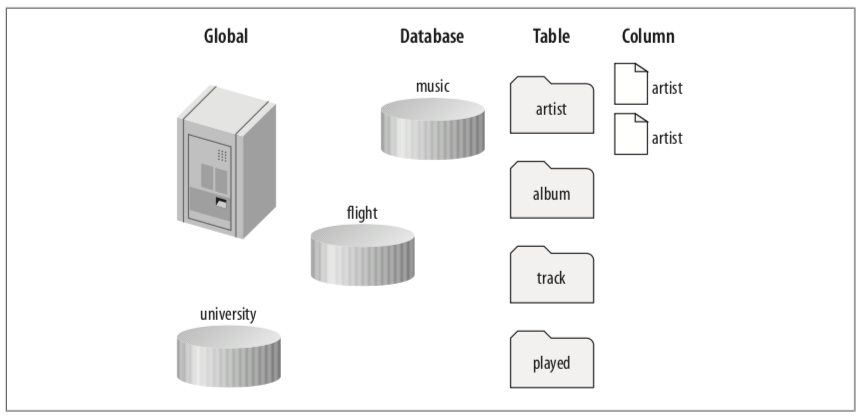
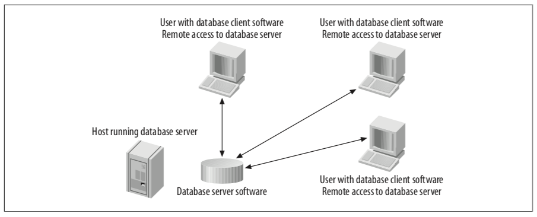
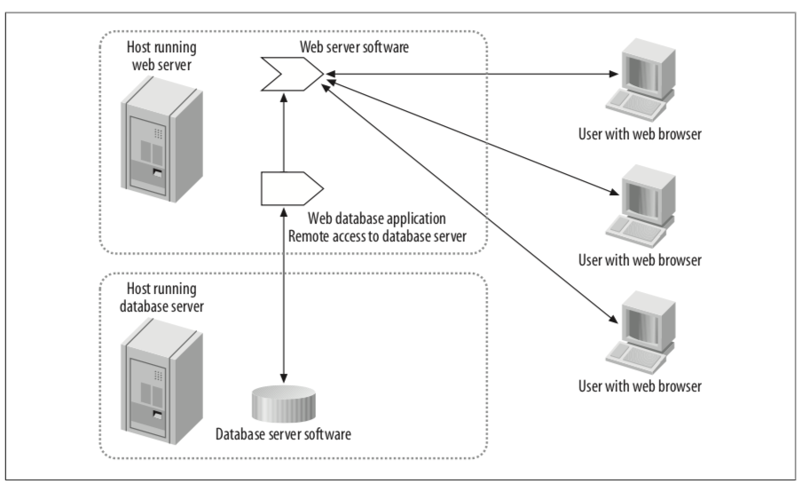
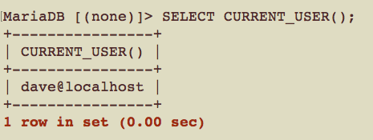

# CSCI360 Spring 2021
# Chapter 9: Managing Users and Privileges
Objectives:
+ Understand MySQL privileges
+ Add, remove, and change MySQL users and passwords
+ `GRANT` and `REVOKE` privileges
+ Understand MySQL’s default security configuration
+ Devise a security policy for your MySQL server
+ Manage users and privileges using SQL queries
+ Limit server usage by user

# 1. Understanding Users and Privileges
+ MySQL users: MySQLcontrols
  - which users can access the server
  - the databases, tables, and columns on the server that they can access
  - the types of actions that users can carry out on these structures
+ operating system users:
  -  superuser accounts: 
    + the root user on a Linux or Mac OS X server
    + the Administrator on Windows
  - ordinary accounts
    + The ordinary account can’t access or modify sensitive system-wide files, such as the system’s hardware settings, or the MySQL server logfiles or datafiles.
# 2. Creating and Using New Users
+ To create a new user, the `root` user have permission, so we need to connect to the monitor as the `root` user.

~~~~
mysql --user=root --password=the_mysql_root_password
~~~~

+ Now create a new user called `allmusic` who’ll connect from the same system as the one the MySQL server is running on (`localhost`). We’ll grant this user all privileges on all tables in the music database (`music.*`) and assign the password `the_password`:

~~~~
GRANT ALL ON music.* TO 'allmusic'@'localhost' IDENTIFIED BY 'the_password';
~~~~

+ Let's try to use a different dataset or create a new database(We never granted the `allmusic` user the privilege to use other databases or create new databases)

+ Let’s create a second new user who can access only the artist table in the music database (music.artist)

~~~~
GRANT ALL ON music.artist TO 'partmusic'@'localhost' IDENTIFIED BY 'the_password';
~~~~

+ Provide access to another table.

~~~~
-- Since we’re reusing the username and location 'partmusic'@'localhost', there’s no need to provide a password in this second statement
GRANT ALL ON music.album TO 'partmusic'@'localhost';
~~~~

+ You can also allow a user to access only specific columns in a table
  - instead of specifying `ALL` privileges, we’ve specified only `SELECT`
  - you can’t grant all privileges at the column level; you must specifically list them
~~~~
GRANT SELECT (track_id, time) ON music.track TO 'partmusic'@'localhost';
~~~~

+ Start the monitor as `partmusic` and let's take a look at the tables in music.

~~~~
-- 1. 
INSERT INTO artist VALUES (7, "The Jimi Hendrix Experience");
-- 2.
SELECT album_name FROM album WHERE album_id=4;
-- 3. no privileges to retrieve values from the columns other than track_id and time
SELECT * FROM track;
-- 4. 
SELECT time FROM TRACK LIMIT 3;
~~~~

+ Notice that, unlike databases and tables, you can see the details of all columns in a table even if you don’t have access to them.(This is the explanation in the textbook. In XAMPP, we can only see the descriptions of the two granted columns.)

# 3. Privileges
+ [MySQL privileges](https://dev.mysql.com/doc/refman/8.0/en/privileges-provided.html)
  - We only discuss the privileges we have learned in this class
  ~~~~
  DELETE, INSERT, SELECT, SHOW DATABASES, UPDATE
  ALTER, CREATE, DROP, LOAD DATA INFILE, SELECT ... INTO 
  LOCK TABLES, UNLOCK TABLES
  ~~~~
  - For others, see the MySQL documentation.

+ Privileges levels
  - Global level: `ON *.*`
  - Database level: `ON music.*`
  - Table level:  `ON music.album`
  - Column level: `SELECT (album_name, album_id) ON music.album`

+ Privileges and their levels in MySQL

|Privilege| Application|G|D|T|C|
|---|---|---|---|---|---|
|ALL|All simple privileges except the ability to grant privileges (GRANT OPTION)|✓|✓|✓|✗|
|ALTER|The ALTER TABLE statement|✓|✓|✓|✗|
|CREATE|The CREATE statement|✓|✓|✗|✗|
|DELETE|The DELETE statement|✓|✓|✓|✗|
|DROP|The DROP statement|✓|✓|✓|✗|
|EXECUTE|Stored procedures (MySQL version 5 and later only)|✓|✗|✗|✗|
|FILE|Reading and writing of disk files with SELECT ... INTO and LOAD DATA INFILE|✓|✗|✗|✗|
|GRANT OPTION|Ability to grant own privileges to others. For most applications, there is generally no need for this, because the root user decides on access privileges|✓|✓|✓|✗|
|INDEX|The CREATE INDEX and DROP INDEX statements|✓|✓|✓|✗|
|INSERT|The INSERT statement|✓|✓|✓|✓|
|LOCK TABLES|The use of LOCK TABLES and UNLOCK TABLES. Must have SELECT privilege for the tables. Since this is a database-wide privilege, it can only be granted using the database_name.* (or *.*) format|✓|✓|✗|✗|
|SELECT|The use of SELECT, allowing data to be read from the specified table(s)|✓|✓|✓|✓|
|SHOW DATABASES|Controls whether all databases are shown with SHOW DATABASES|✓|✗|✗|✗|
|UPDATE|The use of UPDATE to modify existing data in the specified table(s)|✓|✓|✓|✓|

# 4. The GRANT OPTION Privilege
+ The `GRANT OPTION` privilege allows a user to pass on any privileges she/he has to other users.

~~~~
-- connect to the monitor as the root user
mysql --user=root

-- create a MySQL user hugh (with no password!)
GRANT ALL ON music.* TO 'hugh'@'localhost';

-- allows him to pass on his privileges for the music database to other users
GRANT GRANT OPTION ON music.* TO 'hugh'@'localhost';

-- Quit the monitor, and then reconnect as the MySQL user hugh:
QUIT
mysql --user=hugh

-- let’s give our privileges to another user(passes on all privileges to a new user, selina (with no password). )
GRANT ALL ON music.* TO 'selina'@'localhost';
-- pass on the GRANT OPTION privilege, so that selina can do the same things hugh can on the music database
GRANT GRANT OPTION ON music.* TO 'selina'@'localhost';
-- note: we can combine the two statements above as one
GRANT ALL ON music.* to 'lucy'@'localhost' WITH GRANT OPTION;
~~~~

+ Users can pass on privileges at the same or lower levels

~~~~
-- Since hugh has all privileges for all tables in the music database, he can pass all privileges for only the artist table to a new user, rose, with no password
GRANT ALL ON music.artist TO 'rose'@'localhost';
~~~~
# 5. How Privileges Interact
+ MySQL privilege hierarchy

+ When you grant privileges at a level, those privileges are available at that and all lower levels.
+ When you run a statement, your privileges to run that statement are determined using a logical OR operation. The operation checks whether you have any of the following for the statement:
  - Global privileges
  - Database privileges
  - Table privileges
  - Column privileges
+ If any of these permit the statement, it proceeds. This has an important consequence: if you allow a privilege for a statement at a level, it doesn’t matter if it’s allowed or disallowed at another level.
# 6. Users and Hosts
+ basic principles of connecting to the server (how MySQL validates a connection?)

## 6.1 Local and Remote Users
+ A `local user` connects to the server and accesses the databases from the same computer that the MySQL server is running on (localhost).
  - If the client is local, the connection is made internally through a Unix socket (for Linux and Mac OS X) or through a named pipe (for Win- dows). 
  - This is generally much faster than the TCP/IP network connection used for remote access.
  
  
  
+ A `remote user` connects to the server and accesses the databases from another computer.
  
  
  
  - You should be careful not to give remote access to the database when you can avoid it.
  
  
  
  
  
  
## 6.2 Creating a New Remote User

+ Let's first log into the MySQL server on `ruttle` as the `root` user and create a local user
~~~~
GRANT ALL on *.* TO 'hugh'@'localhost' IDENTIFIED BY 'the_password';
~~~~
+ Then, we can log in as `hugh`
  - Including the `--host=localhost` actually has no effect, since localhost is the default anyway.
~~~~
-- Don't forget to QUIT first
mysql --host=localhost --user=hugh --password=the_password
~~~~
+ We can also use `localhost`'s IP address `127.0.0.1`
~~~~
mysql --user=hugh --host=127.0.0.1 --password=the_password
~~~~
+ Finally, let's try the real IP address ``

## 6.3 Anonymous Users
+ Wildcard characters aren’t allowed in usernames. e.g. `fred%'@'localhost`
+ We can have a user with an empty username that allows anonymous connections and matches all usernames.
  - example: create an anonymous local user who can read data from the music database.
    + Note that the username is specified as two single quotes, with nothing between them.
    + The MySQL server decides which user to log you in as based on a checklist we describe in the next section
  
  
  

## 6.4 Which User Is Connected?
+ what happens if more than one user and host combination matches when a connection is attempted?
+ Example:
  - Let's create two users
  ~~~~
  -- The first user dave can now connect from any host and run only SELECT statements on the music database. '%' means all hosts
  GRANT SELECT ON music.* TO 'dave'@'%' IDENTIFIED BY 'the_password';
  -- The second user dave is specific to the localhost and is allowed all privileges on music.
  GRANT ALL ON music.* TO 'dave'@'localhost' IDENTIFIED BY 'the_password';
  ~~~~
  - Connect to server on `localhost`
  ~~~~
  mysql --user=dave --password=the_password
  ~~~~
  
  
  
  - the user is `dave` on `localhost`, who has priviledge `ALL`, let's double check it.
  ~~~~
  USE music;
  INSERT INTO artist VALUES (8, "The Psychedelic Furs");
  ~~~~
  
+ **How does MySQL decide which user to use when you establish a connection?**
  - 1. MySQL sorts the user entries by host from most to least specific and, for duplicate hosts, any anonymous user entry appears last.
  
  |most to least specific user by host|
  |----|
  |'dave'@'localhost'|
  |''@'localhost'|
  |'hugh'@'192.168.1.%'|
  |'dave'@'%'|
  
  
  - 2. The second step in establishing a connection is matching your connection request against the sorted list.
    + The first entry that matches your connection requirements is used.
    + If none match, you’re denied access.
  
## 7. Checking Privileges
## 8. Revoking Privileges
## 9. Removing Users
## 10. Understanding and Changing Passwords
## 11. The Default Users
## 11.1 Default User Configuration
## 11.2 Securing the Default Users
## 12. Devising a User Security Policy
## 12.1 Choosing Users and Privileges
## 12.2 More Security Tips
## 12.3 Resource-Limit Controls
## 12.4 The mysql_setpermission Program
## 13. Managing Privileges with SQL
## 13.1 The user Table
## 13.2 The db Table
## 13.3 The tables_priv Table
## 13.4 The columns_priv Table
## 13.5 The host Table
## 13.6 Activating Privileges
## 14. Privileges and Performance
## 15. Resetting Forgotten MySQL Passwords
