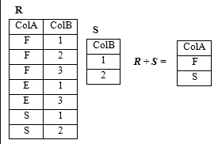
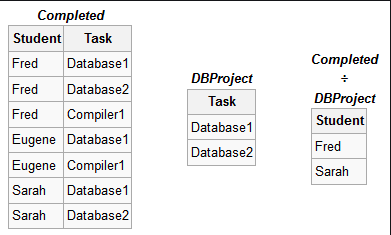

# How to write a query for Q7 in HW5?
# Method 1: no aggregate funtion Count()
+ then, we need to understand one concept we did not cover in our class
## DIVISION
+ DIVISION Operation, denoted by (÷)
  - The division operation is applied to two tables R and S, denoted by R(Z) ÷ S(X) where
    + Z is the set of columns of R
    + X is the set of columns of S
    + X is a subset of Z
    + Let Y be the set of columns of R that are not attributes of S, i.e, Y = Z - X
  - The result of DIVISION is a table T(Y) that includes a row t if row tR appear in R with tR[Y] = t, and with tR[X] = tS for every tuple tS in S.
  - For a row t to appear in the result T of the DIVISION, the values in t must appear in R in combination with every row in S.
  - DIVISION Examples
  
  
  
  
  

+ Now, let's take a look at Q7 in HW5: Print supplier numbers for suppliers who ship at least all those parts shipped by supplier s3. Do not include s3 in the answer(And do not use `COUNT()`) and the shipment table.

shipment

|Sno|Pno|Qty|Price|
|---|---|---|---|
|s1|p1|300|0.005|
|s1|p2|200|0.009|
|s1|p3|400|0.004|
|s1|p4|200|0.009|
|s1|p5|100|0.01|
|s1|p6|100|0.01|
|s2|p1|300|0.006|
|s2|p2|400|0.004|
|s3|p2|200|0.009|
|s3|p3|200|NULL|
|s4|p2|200|0.008|
|s4|p3|NULL|NULL|
|s4|p4|300|0.006|
|s4|p5|400|0.003|

+ Let's change it into a DIVISION problem. 

+ The next step should be how we can get the two tables.
  - table R
  ~~~~
  SELECT Sno, Pno FROM shipment Where Sno != 's3';
  ~~~~
  - table S
  ~~~~
  SELECT Pno FROM shipment WHERE Sno = 's3';
  ~~~~
+ The last step is the DIVISION in MySQL
## DIVISION of Two Queries
+ DIVISION is not part of the SQL standard. Most RDBMSs don’t provide such operator.
+ However, DIVISION can be achieved by using `NOT EXISTS` and `MINUS`.
+ 
  
