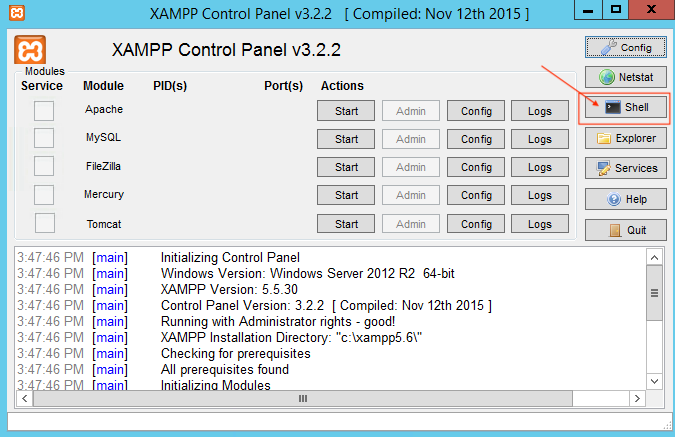
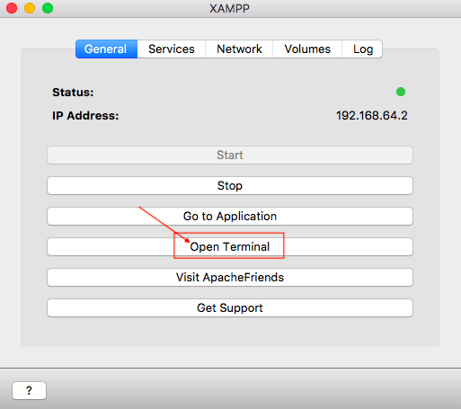
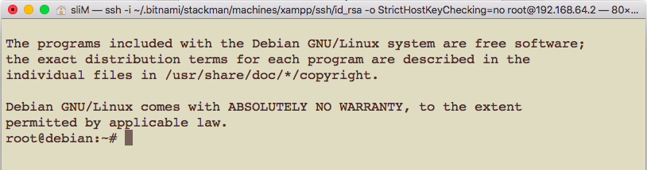
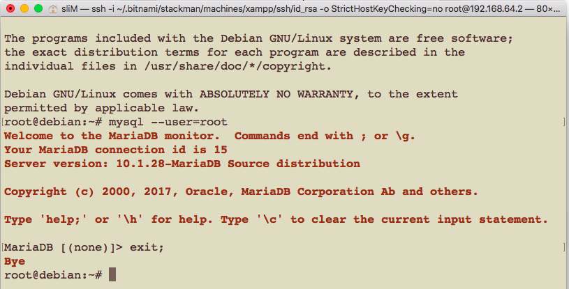
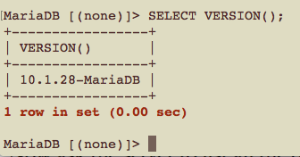
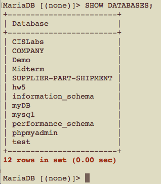

# CSCI 360 Spring 2021
# Dr. Ning Zhang
# Topic 1: MySQL Introduction

# Objectives:
+ Learn the basics of MySQL
+ Learn the installation of MySQL(XAMPP)
+ Learn how to use XAMPP and MySQL monitor

# 1. Basics of MySQL
## What is MySQL
+ pronounced “My Ess Cue Ell”
+ **“the world’s most popular open source database,”** as the developers at the [MySQL AB corporation](http://www.mysql.com) claim
+ modest-sized database
+ MySQL is a relatively recent entrant into the well-established area of **relational database management systems (RDBMs)**
+ Structured Query Language (SQL)
  - insert, retrieve, and manipulate data.
+ We can interact with the database using the PHP and Perl programming languages, and allows interaction with your data over the medium most people prefer these days: the Web.
  
## Why Is MySQL so Popular?
+ The MySQL development process focuses on offering a very efficient implementation of the features most people need. 
  - This means that MySQL still has fewer features than its chief open source competitor, PostgreSQL, or the commercial database engines.
  - The skills you get from this book will serve you well on any platform.
  - MySQL HAS been the choice for so many beginners and small sites, and now for some heavyweight database users in government and industry.
+ Factors
  - Size and speed
  - Ease of installation
  - Attention to standards
  - Responsiveness to community
  - Easy interface to other software

## Elements of MySQL and Its Environment
+ A MySQL installation has two components: 
  - a server that manages the data
  - clients that ask the server to do things with the data
    + MySQL monitor program that allows you to connect to a MySQL server and run SQL queries.
    + mysqladmin program that allows you to perform various server administration tasks.
    + any program that knows how to talk to the MySQL server is a client (a program for a web-based shopping site or an application to generate sales graphs for a marketing team can both be clients).
      - web server vs. database server
        
  
+  Four aspects of using MySQL
  - MySQL server
  - SQL
    + core of MySQL use
  - Programming languages
    + a general-purpose programming language such as PHP or Perl to automatically create and execute SQL queries on the MySQL server.
  - Web database applications
    + you can use PHP or Perl to create dynamic, database-driven web applications that can publish information from the database to the Web, and cap- ture information provided by users.

## The LAMP Platform
+ Linux operating system
+ Apache web server
+ MySQL database management system
+ Perl or PHP scripting language.

## Structured Query Language

# 2. Installation of MySQL
+ On textbook "Learning MySQL", Chapter 2 introduces the installation of the LAMP platform in details.
+ In our class, we use the XAMPP application.
  - [XAMPP Tutorial](XAMPP%20Tutorial.md)

# 3. Using the MySQL Monitor
+  client-server architecture
  - clients connect to the server to perform database operations
  
  
  
+ The standard MySQL command-line client or “monitor” program provided by MySQL AB is the client you’ll probably use the most often.
  - The monitor allows you to control almost all aspects of database creation and maintenance using SQL and the custom MySQL extensions to SQL.

## Starting the Monitor
+ The monitor program is called simply mysql and is found in a directory with the other MySQL programs. 
  - The exact location depends on your operating system and how you chose to install MySQL
    + you can locate the promgram from XAMPP directly
  
  
  
  
  
  
  
  - from the command line, you type
    ~~~~
    mysql --user=root
    ~~~~
    
    
    
    + Note: I am using MAC, the mysql program may look different on Windows, but all the commands we use in this class will be the same.
    + Note: The default password is NULL, if you have set up a password, you need to use the following command
    ~~~~
    mysql --user=root --password=the_mysql_root_password
    ~~~~
## Stoping the Monitor

~~~~
exit;
~~~~

## Commands
+ version of MySQL
~~~~
SELECT VERSION();
~~~~

+ Note: Do NOT miss the ;

+ list all the databases 

~~~~
SHOW DATABASES;
~~~~
  

+ 
